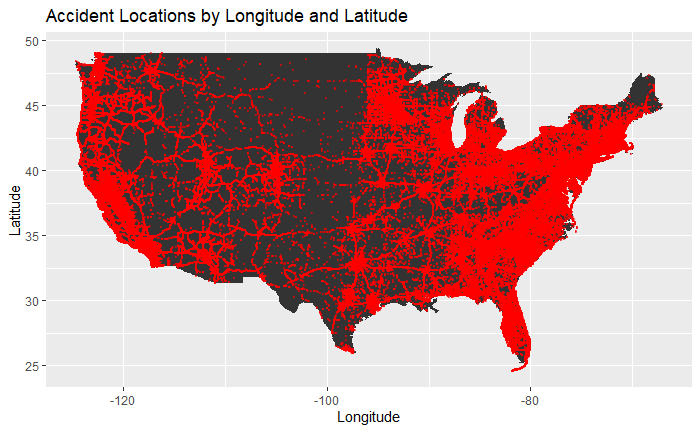
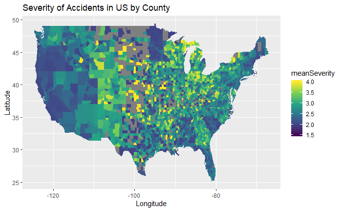
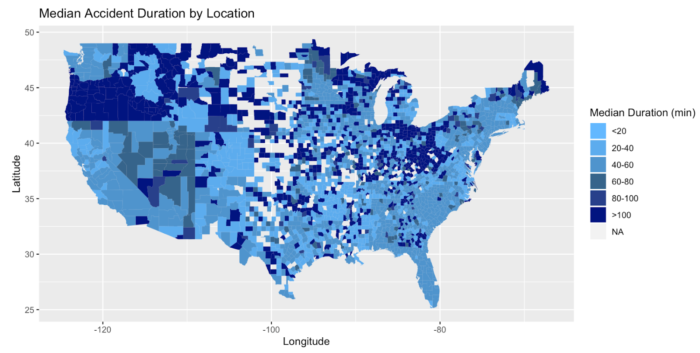
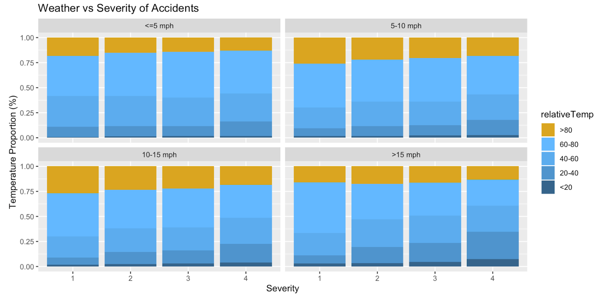
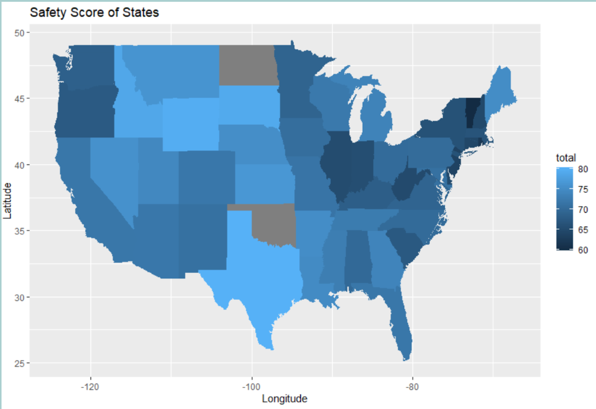

*Note in order to reduce time knitting the html we chose to use image files of our graphs instead of the raw code*

**Introduction**

Sadly, accidents are very common. Every year, there are approximately 6 million car accidents in the US alone according to the Department of Transportation. Our group thought it would be interesting to do our own analysis of US Accidents Data. US-Accidents can be used for numerous applications such as car accident prediction, studying car accidents hotspot locations, and studying the impact of weather and other variables on accident occurrence. We focused on more visualization aspects of these, as that is the bulk of what we learned in class. This data was found on Kaggle.com. This is a countrywide car accident dataset, which covers 49 states of the United States. The accident data are collected from February 2016 to December 2019. Currently, there are about 3.0 million accident records in this dataset. Which we had to narrow down to a manageable size. 

*Data Details*

Our data set had 49 columns. We chose not to use many columns such as Source- which was the API from which the data was gathered, or Traffic Message Channel (TMC) - which provides a more detailed description of the accident. As both of these were categorical variables and the TMC column would require Natural Language Processing we did not see an advantage in using it. We did use columns such as severity- which shows the severity of the accident, a number between 1 and 4, where 1 indicates the least impact on traffic (i.e., short delay)  and 4 indicates a significant impact on traffic (i.e., long delay). We also used weather information and the duration of traffic accident information to answer questions we had. 

*Data Cleaning*

In order to clean the data especially for the time column, we had to get rid of some of those outlier dates as there were only a couple dates in 2015 and 2020 that were recorded. This caused us to get rid of those points as it will help us to explain the progression over time better when working with a continuous chunk of dates. 

**Visualization**

The first thing we did when working with the data was to plot all of the accidents on a map of the US in order to try and look for any patterns or trends that may be occurring with the data (figure 1). In this, we saw quite a few obvious trends. The first of which is that most of the data is on the coasts of the US. This could be due to underreporting of accidents or simply due to the fact that many more people live on the coasts than in the middle part of the US. The fact that most of the data is not only on the coasts but also around population centers, such as large cities like Houston, Des Moines,etc.. , suggests that the accidents are far more likely to occur in areas with lots of people. Another trend we saw is the fact that major interstates and highways are also easy to find on this map (for example Interstate 35 and 80 are easy to spot in Iowa). This suggests that it is not only the number of people in an area that affects the number of accidents but the amount of travel as well. Since highways have no permanent presidents but tens of thousands of people drive them every day.

[Figure 1]

**Severity**

In order to get a better understanding of how safe certain regions are in the US, we created a visualization of the severity of an accident based on the mean severity in a given county (figure 2). That showed us another interesting trend. That being that the middle of the country was involved in more severe accidents than the coasts, even though coasts had more accidents overall. We came up with two possible explanations for this, the first being that since we are missing a lot of data in the middle of the country (note the grey counties) we could be dealing with some under-reporting of mild accidents and only more severe accidents were reported in the data set. The second explanation is that since the midwest and other regions like it are known as fly-over states or states one only travels through on their way somewhere else. Most of the accidents could be occurring on the interstates/highways. This would mean that most accidents are at high speed which is inherently more severe and dangerous than a low-speed accident. This explanation is supported by the visualization in figure 1 since most of the accidents in these regions are clustered around major roadways.

[Figure 2]

**Duration**

We analyzed the relationship between the duration and location of an accident across the counties of the United States in order to discover which locations handle accidents the fastest and which handle accidents the slowest. To do this, we first had to create a duration variable using the lubridate package. We then grouped these durations by county and found the median accident duration for each county. We used the median rather than the mean as a central measure because data was skewed severely to the right in some parts of the country. We then created a median duration factor which sorted the county medians into six twenty-minute bins. This factor was then mapped across the country to visualize the relative duration of accidents by county with darker areas showing longer typical accident durations on the following page.

[Figure 3]

In the darker areas of the above map, it typically takes local authorities longer to respond to and clear up an accident than it does for authorities to resolve the same accident in lighter parts of the country. The darkest areas are largely in the northwestern and northeastern parts of the country with some also scattered throughout the central United States. This scattering could be a result of a lack of data as the most severe accidents are more likely to be reported than the less severe accidents. Also of note, dark areas tend to follow the two major mountain ranges in the contiguous United States. This is possibly due to accidents in these areas being more remote and harder to reach. The lightest areas are largely along the coastlines, which tend to be more populated with help closer by.

**Weather**

For the analysis of the relationship between weather and severity, we used temperature in Fahrenheit and wind speed in miles per hour as our weather condition variables. First, we created temperature and wind speed factor variables in order to classify accidents. Several varying visuals were created using ggplot2, all of which showed little in terms of a relationship between weather conditions and accident severity. Ultimately, the percent stacked bar chart with the data grouped by severity, filled by temperature, and facet wrapped by wind speed was chosen as it had the greatest clarity and was easiest to read.

[Figure 4]

We did not find strong evidence of any relationship between weather conditions and accident severity. The similarity of all four panels in the above graphic indicates no relationship between wind speed and accident severity. Every bar is dominated by the moderate temperatures, but looking at the extremes of temperature we can find a slight pattern. Accidents of the lowest severity, 1, tend to have higher proportions of accidents happen in the warmest temperatures and lower proportions of accidents happen in the coldest temperatures than the other severity levels. On the opposite end, accidents of the highest severity, 4, have lower proportions of accidents happen in the warmest temperatures and higher proportions of accidents happen in the coldest temperatures than the other severity levels. Since this is consistent between all panels, it may indicate a slight relationship between temperature and accident severity.

**Time**

In order to make sure we did not have data biased in our time, we did the cleaning as mentioned above. Then in order to better understand accidents in the United States we can look at the data over time. Looking at peak accident time in each month and day helps us to understand what times are safer and in doing so may help explain how accidents happen. By displaying this we saw that the later months of the year tend to have more accidents, and those in the middle of the year have the least amount of accidents. This leads us to think if the weather in the later months or increased traffic during Christmas time is the cause of this or if there are other factors involved. Displaying a regression line of the accident count by date shows that there is an increasing number of accidents happening each year. This is interesting to describe that we are not improving road conditions and traffic to help progress with the increasing number of people driving. As we saw in 2017 traffic accidents have been decreasing which means it is possible to help improve the safety of roads. However, that is not happening anymore from 2018-2019 and we can predict that if nothing happens there will be an increasing number of accidents in the U.S in the future. 

**Safety Score**

The safety score for each state was a sum of different columns. According to the Department of Transportation, the main causes of accidents are distracted driving, drunk driving, and breaking speed limits or high-speed limits. In recent times, more and more drivers get distracted and stop paying attention to the road. Texting, or applying makeup while driving, are common sightings nowadays.  Driving while being drunk is another one of the leading causes of accidents in the US.  Speeding is the second most common cause of accidents. The faster someone drives, the slower his/her reaction time. We could not find data on distracted driving or speeding data, which we will address in greater detail in the 'Challenges' section, so we chose to use data that was available. We were able to find data on what percent of adults in the state reported driving drunk, and we were able to find average speed data for each state. We joined all 3 of those together by state and was left with my data set that we used to plot the safety score by state. We assumed, the higher the severity, the higher the percent of adults drinking, and the higher the speed limit was the less safe a state was. This is why summing all those values per state worked. The higher the score the less safe a state was. The lower the score, the more safe the state was because that state had less severe accidents, less percent of drunk drivers, and lower speed limits. 

[Figure 5]

**Challenges**

*Data Cleaning Challenges*

The first major hurdle we had to overcome was the sheer size of the dataset. The maximum file size in GitHub is 100mb and our dataset is around 2gb in size. This meant we could not store the data in GitHub. So what we came up with was a plan to extract certain columns along with an  ID value in their own CSV file and then use joins to rebuild the dataset inside of R. We decided to do this approach rather than taking a subset or removing rows arbitrarily since the data was not evenly distributed. The coasts made up a majority of the data set and we did not want to risk losing any of the trends or information in the midwest since that area was already missing data. This approach greatly increased the amount of time spent running code and creating visualizations and also limited how “intense” we could make the code before crashing our computers, but we felt it was the correct choice to make sure we did not misrepresent the data.

*Finding Data Challenges*

Our other main challenge was finding outside data for the safety scores. We wanted to include distracted driving information because it is a rising concern, but all the data sets that had information on distracted driving were images of drivers. At this point, we did not have the means or time to translate that into usable information for our project. I also could not find a data set on how many people were speeding in the state or had gotten a speeding ticket, so I settled on information about speed limits in the state. I assumed if it was a higher speed limit, it was less safe as there is a correlation between higher speeds and slower reaction times. 

**Recommendations**

Our recommendations due to our findings were to drive in the summer months of June or July as there are not a lot of accidents that happened during those times as compared to the months later in the year from August through December. Along with this, we found that in the middle of the month is when most accidents happen as compared to the beginning and end of each month. The states that are safer are Vermont, Rhode Island, Illinois, and West Virginia. However, this is just our findings from the data and you should take into consideration your driving experience and road conditions in order to keep safe while driving. We do not suggest you move to Vermont to make sure you stay safe but to understand that you should be more cautious in states like California and stay safe while driving.  

**Conclusion**

In conclusion, this data set provided a plethora of information. We found that California had the most accidents, followed by Texas. We found that while California had many more accidents, the more severe accidents were mostly located in the Midwest. For the duration, it seems it takes Oregon and Idaho the longest to respond to accidents. We did not find strong evidence of any relationship between weather conditions and accident severity, however, it is important to note we used temperature and wind speed as our weather information. If we had data on precipitation amount and type it may have yielded different results. Our final question was to see which state was the safest. We found that it was Vermont. Figure 5 is a nice summary of all the information previously covered. 

**Contributions**

* Eric; 
I was in charge of doing data cleaning and distributing. In addition to that, I was in charge of visualizing the data and looking for trends associated with the location. I also tried to answer the question of “how does the location affect the severity of an accident?”

* Brandon; 
I wrote and contributed all parts of the Time section of the project as well as parts of the recommendations category in the presentation.

* McKenna; 
I found the United States Accident data set on Kaggle that we used for this project, and I also contributed to the formulation of the initial list of questions that analysis of this data set could potentially answer. I was responsible for answering two of the questions, which were related to the duration of accidents by location and the possible relationship between weather conditions and the severity of an accident. Those were also the slides that I covered in the presentation.

* Anyesha; 
For this project, I found additional data sets and joined them together with our original data set to create the Safety Score graphic. 

**References**

* Moosavi, Sobhan, Mohammad Hossein Samavatian, Srinivasan Parthasarathy, and Rajiv Ramnath. “A Countrywide Traffic Accident Dataset.”, 2019.

* Moosavi, Sobhan, Mohammad Hossein Samavatian, Srinivasan Parthasarathy, Radu Teodorescu, and Rajiv Ramnath. "Accident Risk Prediction based on Heterogeneous Sparse Data: New Dataset and Insights." In proceedings of the 27th ACM SIGSPATIAL International Conference on Advances in Geographic Information Systems, ACM, 2019.

* Behavioral Risk Factor Surveillance System (BRFSS), 2012 & 2014,https://data.cdc.gov/Motor-Vehicle/Percentage-of-Adults-Who-Report-Driving-After-Drin/s9bp-7k3m

* “Speed: Maximum Posted Speed Limits by State.” IIHS, www.iihs.org/topics/speed/speed-limit-laws#fn1.
